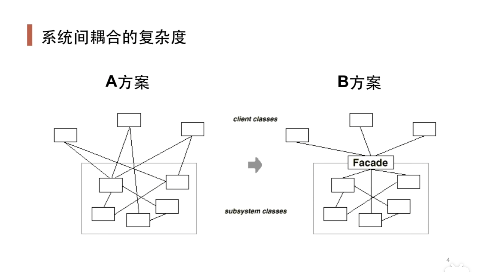

###### 十二、门面模式

1. “接口隔离”模式——解决耦合度太高的问题
   
   - 门面模式
   
   - 代理模式

   - 适配器

   - 中介者

2. 动机与背景
   
   - 系统间耦合较为复杂，不同的对象之间紧密耦合。例如在一个访问过程中涉及到的各种对象，将变化的部分抽象为一个`Facade`，从而让外界只面向这个`Facade`接口

3. 没有使用设计模式的代码

```cpp
// 本节没有示例代码
```

4. 存在的问题
   
   - 在面临变化时，由于复杂的耦合与依赖关系，使得代码更改起来复杂，甚至出错

5. 解决方法
   
   - 使用门面模式，将内部一系列子系统作为一个统一对外提供的接口，简化外部与子系统之间的交互，是一个更高层的接口



6. 使用设计模式的代码

```cpp
// 本节没有示例代码
```

7. 适用场景
   
   - 子系统变化剧烈，耦合紧密，例如：数据对象、连接对象、命令对象、参数对象等等之间与外部都有耦合，就可以尝试利用一个统一的门面接口来对外提供功能

8. 总结
   
   - 从客户角度看，门面模式简化了一整个组件系统的接口，内部的变化不会影响到门面接口的变化

   - 更注重从架构的层次去看整个系统，而不是单个的层次，更像一种架构设计模式
   
   - 并不是一个集装箱，任意放入任意对象，而是耦合度比较大的一系列组件

   - **低耦合！高内聚！**

9. 如何理解“间接”

   - 间接：即剥离稳定与变化的部分

   - 软件作为人和硬件之间的间接，操作系统作为软件和硬件之间的间接，中间件虚拟机等作为软件和操作系统之间的间接，等等

   - 之前所了解的依赖倒置原则、C++的指针等
