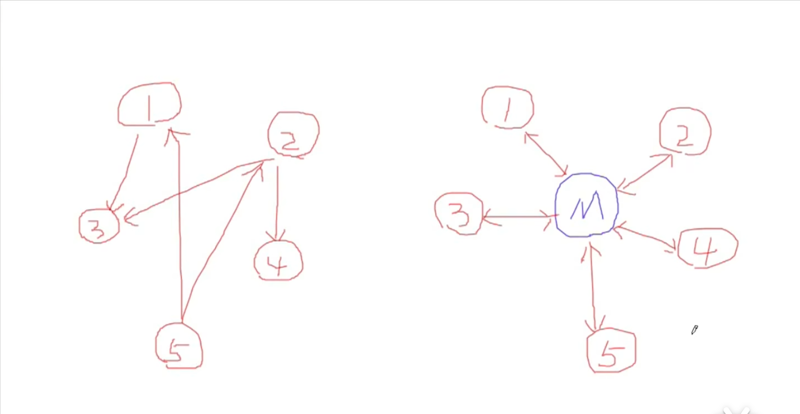

###### 十五、中介者

1. “接口隔离”模式——解决耦合度太高的问题
    - 门面模式
    - 代理模式
    - 适配器
    - 中介者

2. 动机与背景
    - 在一个系统中，多个对象相互关联交互，对象之间维持有复杂的引用关系，遇到需求更改时，直接的引用关系面临不断的变化

3. 没有使用设计模式的代码
```cpp
// 本节没有示例代码
```

4. 存在的问题
    - 面临需求变化时，相互交互的对象之间存在紧耦合关系，无法抵御变化

5. 解决方法
    - 使用中介者，来封装各个对象之间的相互引用（封装变化）；将**编译时依赖**转变为**运行时依赖**



6. 使用设计模式的代码
```cpp
// 本节没有示例代码
```

7. 适用场景
    - 多个对象相互关联交互，对象之间维持有复杂的引用关系

8. 总结
    - 将多个对象间的关联关系解耦，利用中介者集中管理，将其转变为多个对象和一个中介者关联
    - 可以对中介者进行分解处理
    - 与门面模式区别，门面模式是解耦系统间（单向）的关联关系，而中介者是解耦各个对象之间（双向）的关联关系
